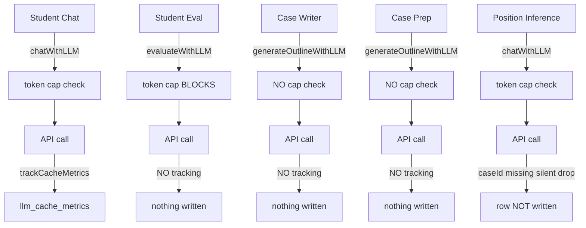
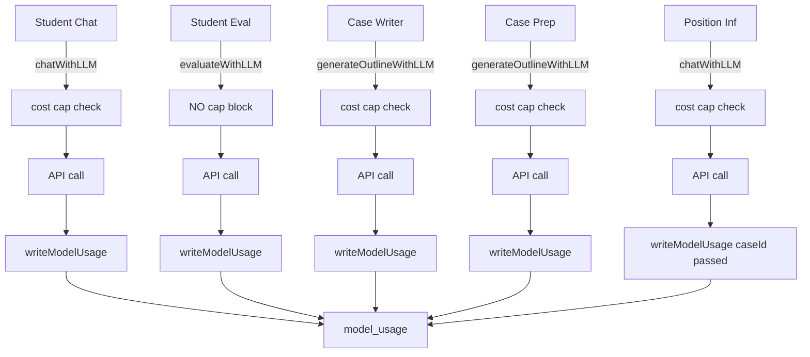

# AI Usage Tracking and Screen — Implementation Plan

**Status:** Implementation-ready (pending pre-deploy migration test against `ceochat_prod_copy`)
**Source:** Adapted from `~/.cursor/plans/ai_usage_tracking_&_screen_4c9116e7.plan.md`
**Last updated:** 2026-05-20
**Migration number:** `060` (the original `057` is already taken by `057_feedback_context_screen.sql`)

## How to read this document

Each refinement item is marked inline next to the section it affects:

- **Decided:** — choice has been made, no further input needed
- **Open question:** — needs a decision from the project owner before implementation starts
- **TODO before implementation:** — requires a code read or short design pass to resolve

When all items are **Decided:** or resolved, this plan is implementation-ready.

---

## Overview

Replace `llm_cache_metrics` with a new cost-first `model_usage` table; switch the per-instructor usage cap from monthly tokens to a weekly dollar amount; add per-instructor vendor restrictions defaulting to `openrouter`; build a cost-focused AI Usage panel in the renamed Monitor tab with a warning banner on the dashboard.

## Core Design Decisions

| Decision | Choice |
|---|---|
| Cost metric | Dollar amount (`est_cost_usd`) — not tokens |
| Cap period | Calendar week (Monday 00:00 – Sunday 23:59) |
| Cap field | `weekly_ai_usage_cap DECIMAL(8,4)` on `instructors` (dollar amount, NULL = no cap) |
| Warning field | `weekly_ai_usage_warning_pct TINYINT(3)` (0–100, default 80) — instructor-settable |
| Who sets cap | Any admin; instructor sets their own warning % |
| Vendor default | `allowed_vendors JSON` on `instructors`, defaults to `["openrouter"]` for new instructors |
| Vendor enforcement | At model SELECTION time only (dropdowns filter by allowed_vendors); existing assignments grandfathered |
| Token storage | `raw_usage JSON NULL` only — no discrete token columns in `model_usage` |
| Cost source | OpenRouter: `usage.cost` directly; direct providers: computed from `models.cpm_*` at insert time |
| Warning display | Dismissable yellow banner below dashboard header when `cost_used >= cap * warning_pct / 100` |

> **Decided — cap window timezone.** Hardcoded to `America/Denver` for v1. Week bounds (Monday 00:00 – Sunday 23:59 local) computed in app code using TZ-aware date math; the UTC instants derived from those bounds are what's passed to MySQL. UI displays the week as e.g. "Mon 5/18 – Sun 5/24 MT".

> **Decided — who can change `allowed_vendors`.** Any admin (not superuser-only). The UI must show a confirmation dialog explaining the cascade: existing section configs keep working but the instructor can't pick removed vendors in new dropdowns, and any stored API keys for removed vendors are preserved but greyed out (see Part 5).

---

## Current State Gaps



**After this work:**



> **Resolved (code read 2026-05-20) — LLM callsite inventory is complete.** No provider SDK imports exist outside `llmRouter.js`. Only `@google/genai` is installed (used inside `llmRouter.js`); OpenAI and Anthropic are called via raw `fetch()` from inside the router. All LLM paths route through `chatWithLLM` / `evaluateWithLLM` / `generateOutlineWithLLM`. No bypass to handle.

---

## Part 1 — Database Migration

**New file:** `server/migrations/060_model_usage_and_cost_cap.sql`

### 1a. New `model_usage` table

Cost-first design. Token details extractable from `raw_usage` JSON on demand.

```sql
CREATE TABLE IF NOT EXISTS model_usage (
  id            BIGINT AUTO_INCREMENT PRIMARY KEY,

  purpose       VARCHAR(50)  NOT NULL,
                -- student_chat | evaluation | case_writer
                -- case_prep | position_inference | model_test

  case_id       VARCHAR(30)  NULL,   -- student_chat, evaluation, case_prep, position_inference
  project_id    VARCHAR(36)  NULL,   -- case_writer (case_writer_projects.id)
  section_id    VARCHAR(20)  NULL,   -- section context for student-facing calls

  model_id      VARCHAR(255) NOT NULL,
  provider      VARCHAR(50)  NOT NULL,  -- openai | anthropic | google | openrouter

  instructor_id VARCHAR(64)  NULL,   -- NULL = system env key with no instructor
  use_system_key TINYINT(1)  NOT NULL DEFAULT 0,

  cache_hit     TINYINT(1)   NOT NULL DEFAULT 0,

  -- Cost snapshot at insert time (authoritative, not recomputed later).
  -- OpenRouter: usage.cost directly. Direct providers: computed from models.cpm_* at call time.
  -- NULL when pricing is not configured for the model.
  -- DECIMAL(12,6): supports values from $0.000001 to $999,999.999999
  est_cost_usd  DECIMAL(12,6) NULL,

  -- Full provider usage blob (source of truth for token breakdown on demand)
  raw_usage     JSON NULL,

  created_at    TIMESTAMP NOT NULL DEFAULT CURRENT_TIMESTAMP,

  INDEX idx_instructor_week (instructor_id, created_at),
  INDEX idx_purpose_date    (purpose, created_at),
  INDEX idx_case_date       (case_id, created_at),
  INDEX idx_section_date    (section_id, created_at),
  INDEX idx_model_date      (model_id, created_at)
) ENGINE=InnoDB DEFAULT CHARSET=utf8mb4 COLLATE=utf8mb4_unicode_ci;
```

`DECIMAL(12,6)` stores down to $0.000001 — matching OpenRouter's reported precision — while supporting totals up to $999,999. A typical cheap model call costs roughly $0.000011; a heavy Case Writer call might be $0.020000.

> **Decided — retention policy for `raw_usage`.** Truncate `raw_usage` to NULL after 90 days. Cost rows (`est_cost_usd`, `purpose`, `model_id`, etc.) are retained indefinitely; only the JSON detail blob is dropped. Implementation: a small daily job (cron or app-startup interval) running `UPDATE model_usage SET raw_usage = NULL WHERE raw_usage IS NOT NULL AND created_at < DATE_SUB(NOW(), INTERVAL 90 DAY)`. Add as a new file `server/jobs/truncateOldRawUsage.js` invoked from `server/index.js`. The "Cost Breakdown" panel in the AI Usage UI must gracefully degrade for periods where `raw_usage` is missing ("Token detail not available for calls older than 90 days").

### 1b. Alter `instructors` table

Three new columns. Use conditional `ALTER` blocks matching the project's existing migration style (see prior `instructors`-touching migrations for the pattern):

```sql
-- weekly_ai_usage_cap DECIMAL(8,4) NULL  — dollar amount (NULL = no cap); any admin may set
-- weekly_ai_usage_warning_pct TINYINT UNSIGNED NOT NULL DEFAULT 80  — instructor may set their own
-- allowed_vendors JSON NOT NULL  — see backfill below
```

**Backfill:**
- Existing instructors at migration time: `'["openai","anthropic","google","openrouter"]'` (backward compat)
- New instructors created after migration: default to `'["openrouter"]'` (handled in `instructors.js` insert path, not by SQL default since JSON columns can't have non-literal defaults in older MySQL)

**Drop `monthly_token_cap`** from `instructors`. Remove all references in `usageGuard.js`, `instructors.js`, and `InstructorManager.tsx`.

> **Resolved (code read 2026-05-20) — no conditional-ALTER pattern needed.** The project does **not** use conditional/idempotent ALTER blocks (verified against `055_instructor_usage_cap.sql`, which uses plain `ALTER TABLE instructors ADD COLUMN ...`). Idempotency is provided by the migration runner (`npm run migrate` / `server/scripts/run-pending-migrations.js`) which tracks applied files in `schema_migrations`. Migration 060 should use plain `ALTER TABLE` statements; do not wrap them in `IF NOT EXISTS` / stored procedure conditionals.

> **Decided — no down migration.** This is a forward-only project. The `monthly_token_cap` drop is destructive, but the column has no production data worth preserving (token caps were never widely deployed). Document in the migration header that rollback requires manual SQL.

> **TODO before implementation — test against a copy of prod.** Per `CLAUDE.md`, the convention is to use `ceochat_prod_copy` for dev. Run the migration against a fresh copy of the current prod schema before applying, and verify all existing routes still work.

### 1c. `llm_cache_metrics` — no migration, but explicit sunset notice

Existing rows stay. The existing Cache Analytics screen (`CacheMetrics.tsx` / `llmMetrics.js`) continues to query `llm_cache_metrics` unmodified. New rows are written only to `model_usage` going forward.

> **Decided — Cache Analytics screen handling (v1) and rebuild plan (v2).**
>
> **v1:** Add a one-line sunset banner at the top of the Cache Analytics screen (`CacheMetrics.tsx`): *"No new data after YYYY-MM-DD — see AI Usage for current usage data."* The screen continues to query `llm_cache_metrics` and serves as a frozen historical record for one semester.
>
> **v2 (deferred):** Rebuild Cache Analytics on `model_usage`. Approach:
> - Rewrite the 4 SQL queries in `server/routes/llmMetrics.js` to read from `model_usage`. Token columns come from `JSON_EXTRACT(raw_usage, ...)` with COALESCE across provider-specific paths (`prompt_tokens` for openai/openrouter, `input_tokens` for anthropic, `promptTokenCount` for google; similar for cached and output).
> - Map `request_type` (chat/eval) to filters on the new `purpose` field (`purpose IN ('student_chat','evaluation')`).
> - Handle the 90-day `raw_usage` truncation: token counts return NULL for old rows; display "—" with a footnote "Token detail not available for calls older than 90 days." Cache-hit rate remains accurate for all periods (it's a discrete column).
> - Consider whether the v2 rebuild belongs as a standalone screen or as a "Cache Performance" expandable section inside the new AI Usage panel — defer that UI decision to v2.
>
> **Why deferred:** ~3–4 hours of work, but (a) the new AI Usage panel already covers the more important business metric (cost), (b) the 90-day truncation creates a permanently degraded experience for historical token analytics, and (c) deferring keeps v1 scope tight. The existing frozen screen preserves all pre-migration data for reference.

> **Decided — no backfill from `llm_cache_metrics` to `model_usage`.** Instructors will see "$0 used this week" on rollout day even if they've been heavy users. Document this in the rollout notes and in the AI Usage panel itself ("Tracking started YYYY-MM-DD").

---

## Part 2 — Cost-Based Usage Guard

**Rewrite `server/services/usageGuard.js`**

```js
// Calendar week bounds: Monday 00:00:00 to Sunday 23:59:59 America/Denver
function currentWeekStart() {
  // Compute Monday 00:00 in the target TZ, return as UTC Date for SQL
}

export async function getWeeklyUsage(instructorId) {
  // Returns: { costUsed, cap, warnPct, warnThreshold, capActive,
  //            overWarning, overCap, useSystemKey }
}

export async function assertWithinCostCap(instructorId) {
  // Throws UsageCostCapExceededError if overCap (capActive && costUsed >= cap)
  // No-op when: instructorId null, cap null, or use_system_key=0
}
```

Cap enforcement applies only when `use_system_key = 1` (BYO-key instructors pay their own provider bill). Admins setting caps on BYO-key instructors is allowed but the guard stays a no-op.

**New error class:** `UsageCostCapExceededError` — `code: 'INSTRUCTOR_COST_CAP_EXCEEDED'`, carries `used` and `cap` (dollar values). Routes surface this as HTTP 409 with the cost amounts so the UI can display "$X.XX of $Y.YY".

> **Decided — race condition / cap overshoot.** Accept overshoot. Document the behavior in code comments and in the admin help text for the cap field. Concurrent overshoot is bounded by `(concurrent_calls × per_call_cost)`, which for typical $0.02 calls is rounding error against a $10 cap. Revisit if production telemetry shows meaningful overruns.

> **Decided — evaluation bypass policy.** Evaluations always proceed even when the instructor is over cap (a student finishing a case shouldn't fail because their classmates blew the budget earlier). When an over-cap evaluation runs, log a `console.warn` with prefix `EVAL_OVER_CAP` including instructor_id, case_id, and current weekly cost — greppable in logs for after-the-fact review.

> **Decided — admin impersonation and caps.** The instructor's cap applies (not the admin's), so the admin sees the same behavior the instructor would see. `instructorId` resolution in LLM routes must reflect the subject (impersonated instructor), not the actor (admin).
>
> **Resolved (code read 2026-05-20) — `instructorId` resolution pattern is well-established.** Auth middleware (`server/middleware/auth.js`) sets `req.effectiveInstructorId` from the `X-Act-As-Instructor` header (or the `actAs` JWT claim) whenever an admin is impersonating. The codebase-wide pattern is:
> ```js
> const instructorId = req.effectiveInstructorId
>   || (req.user.role === 'instructor' ? req.user.id : null);
> ```
> All new code threading `instructorId` into LLM config (caseWriter, casePrep, evaluations, usage routes) must use this pattern. `server/routes/llm.js` for student chat uses `resolveInstructorForStudentCase(studentId, caseId)` (resolves to the section's owning instructor) — this is correct and unchanged.

> **Decided — fire-and-forget write failures.** `writeModelUsage` errors stay swallowed with `console.warn` for v1. If MySQL is down, the LLM call has already happened and the user shouldn't see an error. Add a clear `console.error` (not warn) with `MODEL_USAGE_WRITE_FAILED` prefix so it's greppable in logs; a future v2 can add a retry queue if accounting accuracy becomes critical.

---

## Part 3 — New `writeModelUsage` Helper

**New file:** `server/services/modelUsageWriter.js`

```js
export async function writeModelUsage({
  purpose, caseId = null, projectId = null, sectionId = null,
  modelId, provider, instructorId = null, useSystemKey = false,
  cache_hit = false, est_cost_usd = null, raw_usage = null,
}) { /* async INSERT into model_usage, errors logged as MODEL_USAGE_WRITE_FAILED */ }
```

**Cost computation at call time (inside `llmRouter.js`, before calling `writeModelUsage`):**

```js
function computeEstCost(provider, rawUsage, modelConfig) {
  // OpenRouter returns an authoritative cost in USD directly
  if (provider === 'openrouter' && rawUsage?.cost != null) {
    return Number(rawUsage.cost);
  }
  // Direct providers: compute from token counts + model CPM pricing
  const { cpm_input, cpm_input_cache, cpm_output } = modelConfig;
  if (!cpm_input && !cpm_output) return null; // pricing not configured → store NULL

  // Token field names differ per provider; normalize here
  const tokens = normalizeUsageTokens(provider, rawUsage);
  return (
    (tokens.input    * (cpm_input       || 0)) +
    (tokens.cached   * (cpm_input_cache || 0)) +
    ((tokens.output + tokens.reasoning) * (cpm_output || 0))
  ) / 1_000_000;
}

function normalizeUsageTokens(provider, raw) {
  if (provider === 'google') {
    // Gemini returns usageMetadata with different field names
    return {
      input:     raw?.promptTokenCount     || 0,
      cached:    raw?.cachedContentTokenCount || 0,
      output:    raw?.candidatesTokenCount  || 0,
      reasoning: raw?.thoughtsTokenCount    || 0,
    };
  }
  if (provider === 'anthropic') {
    // v1 approximation: cache_creation_input_tokens (cache write, premium-priced)
    // is rolled into `input` and billed at the regular input rate. Slight
    // under-pricing of writes (~25%) is accepted for v1 simplicity.
    // See "Anthropic cache-write pricing" decision in Part 3.
    return {
      input:     (raw?.input_tokens || 0) + (raw?.cache_creation_input_tokens || 0),
      cached:    raw?.cache_read_input_tokens     || 0,
      output:    raw?.output_tokens               || 0,
      reasoning: 0,
    };
  }
  // openai (and openrouter falling through to direct compute, rare)
  return {
    input:     raw?.prompt_tokens                                  || 0,
    cached:    raw?.prompt_tokens_details?.cached_tokens
               || raw?.cached_tokens                               || 0,
    output:    raw?.completion_tokens                              || 0,
    reasoning: raw?.completion_tokens_details?.reasoning_tokens    || 0,
  };
}
```

> **Resolved (code read 2026-05-20) — provider response shapes confirmed; one v1 approximation accepted.** Field names verified against `llmRouter.js`:
> - **OpenAI / OpenRouter (when falling through):** `data.usage.prompt_tokens`, `prompt_tokens_details.cached_tokens` (newer) or `cached_tokens` (legacy), `completion_tokens`, `completion_tokens_details.reasoning_tokens`.
> - **Anthropic:** `data.usage.input_tokens`, `cache_read_input_tokens`, `cache_creation_input_tokens`, `output_tokens`. **Note: two distinct cache fields.**
> - **Gemini:** `usageMetadata.promptTokenCount`, `cachedContentTokenCount`, `candidatesTokenCount`. Accessed via `response.usageMetadata || response.response?.usageMetadata` (SDK shape varies).
>
> **Decided — Anthropic cache-write pricing (v1 approximation).** Anthropic's `cache_creation_input_tokens` (cache write, ~125% of input price) and `cache_read_input_tokens` (cache hit, ~10% of input price) have different real-world costs. v1 treats them simply:
> - `cache_read_input_tokens` → priced at `cpm_input_cache` (cheap)
> - `cache_creation_input_tokens` → priced at `cpm_input` (regular input rate — slight under-pricing of ~25%)
>
> Rationale: cache reads dominate volume in typical chat workloads, and the over-estimate from treating writes at regular input rates is small relative to the savings already captured on reads. Document as a known v1 approximation in the `computeEstCost` source. v2 may add `cpm_input_cache_write` to the `models` table if precision becomes a real concern. `normalizeUsageTokens` for Anthropic in Part 3 should expose both fields as `cached` (read) and `input` (write rolls in with regular input).

> **Resolved (code read 2026-05-20) — OpenRouter `usage: {include: true}` is NOT currently set.** The existing `callOpenRouter()` payload (around llmRouter.js:96–110) does not include the `usage` parameter, so `data.usage.cost` will be absent. **Implementation must add it** to all three `callOpenRouter()` call paths:
> ```js
> const payload = {
>   model: modelId,
>   messages,
>   ...runtimeParams,
>   usage: { include: true },  // ← required for data.usage.cost
> };
> ```
> If `usage.cost` is somehow still absent at runtime (e.g., OpenRouter returns it as null for a particular model), the cost computation falls through to the direct-provider math, which will return NULL for OpenRouter-prefixed model IDs (e.g., `openai/gpt-5`) since those aren't priced in the `models` table by that ID. `est_cost_usd = NULL` is acceptable for those rare cases and the unpriced-models setting (`allow_unpriced_llm_calls`) controls whether the call is blocked or proceeds.

**Pricing source for direct providers:** `models.cpm_input`, `models.cpm_input_cache`, `models.cpm_output` set manually in Admin → Models or auto-populated by `POST /api/models/openrouter/lookup`. When NULL, `est_cost_usd` is stored as NULL and displayed as "—".

> **Decided — cap behavior for unpriced models.** Add a settings-table row `allow_unpriced_llm_calls` (default `true` to preserve current behavior).
> - When `true`: unpriced calls run normally; `est_cost_usd` is stored as NULL; the AI Usage panel shows a "N calls had no pricing data" footnote.
> - When `false`: `assertWithinCostCap` looks up the model's `cpm_input`/`cpm_output` before the cost check. If both are NULL, throws `UnpricedModelBlockedError` (`code: 'MODEL_UNPRICED'`, HTTP 409). User-facing message: "This model has no pricing configured — ask your administrator to set it in Admin → Models."
>
> Setting is admin-only, surfaced in Admin → Settings. The block applies regardless of whether a cap is set, so admins can use it as a "force pricing discipline" toggle. Add the setting to migration 060.

---

## Part 4 — Wire `writeModelUsage` into All LLM Paths

**`server/services/llmRouter.js`**

- Remove `trackCacheMetrics` entirely.
- Import `writeModelUsage` from `modelUsageWriter.js`.
- In every provider branch of `chatWithLLM`, `evaluateWithLLM`, `generateOutlineWithLLM`: compute `est_cost_usd`, call `writeModelUsage(...)` fire-and-forget.
- Replace `assertWithinUsageCap` calls with `assertWithinCostCap`.
- `evaluateWithLLM`: remove cap check; add `writeModelUsage`.
- `generateOutlineWithLLM`: add `assertWithinCostCap` at top; add `writeModelUsage` in each branch.

**`server/services/positionInference.js`**

```js
config: { temperature: 0.3, instructorId, caseId: chat.case_id, purpose: 'position_inference' }
```

**`server/routes/caseWriter.js`**

```js
config: { ...(params.config||{}), instructorId, purpose: 'case_writer',
          projectId: params.projectId || null }
```

**`server/routes/casePrep.js`**
Add `purpose: 'case_prep'` and `caseId` to `generateOutlineWithLLM` config.

**`server/routes/llm.js` and `server/routes/evaluations.js`**
Add `sectionId` and `purpose` to LLM config objects.

> **Decided — student-facing UX for `INSTRUCTOR_COST_CAP_EXCEEDED`.** Student sees: *"Your instructor's AI usage limit has been reached for this week — please contact them."* Displayed inline in the chat UI as a non-dismissable error state (chat input disabled). Instructor gets the warning banner the next time they log in; no separate notification system in v1.

---

## Part 5 — Per-Instructor Vendor Restrictions

### Schema (in migration 060)

`instructors.allowed_vendors JSON NOT NULL`

Existing instructors at migration time receive `["openai","anthropic","google","openrouter"]`. New instructors default to `["openrouter"]`.

### Enforcement: model selection only

**`server/routes/models.js` — `GET /api/models`**

```js
if (instructorId) {
  const [iRow] = await pool.execute(
    'SELECT allowed_vendors FROM instructors WHERE id = ? LIMIT 1', [instructorId]);
  const allowedVendors = JSON.parse(iRow[0]?.allowed_vendors || '["openrouter"]');
  data = data.filter(m => allowedVendors.includes(m.vendor));
}
```

This automatically restricts section `chat_model`/`super_model` dropdowns, the Case Writer model picker, and any other UI that calls `GET /api/models`. No call-time check; existing assignments are grandfathered.

> **Decided — grandfathering is intentional.** A section already configured with a now-disallowed model keeps working. This is by design: changing `allowed_vendors` should never break a class in session. The instructor can't pick that model in a new dropdown, but if a previously-selected one is in use, it runs.

> **Decided — surfacing grandfathered assignments.** Deferred to v2. For v1, document the behavior in the admin help text for `allowed_vendors` (using `HelpTooltip` in `InstructorManager.tsx`): "Removing a vendor prevents future model selections from that vendor but does not affect existing section or project assignments."

> **Decided — orphaned API keys on vendor removal.** Stored keys are preserved (re-enabling vendor access is friction-free), but visually distinct: the vendor card in `ApiKeysManager.tsx` is greyed out with a lock icon and a "Removed by admin" notice. The underlying `instructor_api_keys` row is untouched.

### Admin management

**`server/routes/instructors.js`**

Add `allowed_vendors`, `weekly_ai_usage_cap`, `weekly_ai_usage_warning_pct` to the `PATCH /api/instructors/:id` body. Validate `allowed_vendors` against the four known vendors. Admin (per the table at the top — see open question) may update.

**`components/InstructorManager.tsx`**

Multi-select for `allowed_vendors` in the instructor edit modal under "Vendor Access":

```
[ ] OpenRouter (default — covers all models through one key)
[ ] OpenAI (direct)
[ ] Anthropic (direct)
[ ] Google (direct)
```

Plus cap and warning-pct number inputs.

---

## Part 6 — API Keys Screen Changes

**`components/ApiKeysManager.tsx`**

- Fetch instructor's `allowed_vendors` (include in `GET /api/api-keys` response).
- Render OpenRouter first, styled as primary/recommended.
- For vendors NOT in `allowed_vendors`: grayed-out card with lock icon:

```
🔒  Anthropic
    This vendor is accessible through OpenRouter.
    See the administrator for details.
```

Key entry fields hidden/disabled for disallowed vendors. If a stored key exists for a now-disallowed vendor, the vendor card stays visible but greyed out with a lock icon and "Removed by admin — stored key preserved" notice (see "orphaned API keys" decision in Part 5).

Admins viewing their own keys (not impersonating) see all vendors.

---

## Part 7 — Usage API

**New file:** `server/routes/usage.js`

### `GET /api/usage/weekly-status`

Lightweight — called on every dashboard load to drive the warning banner.

```json
{
  "costUsed": 8.42,
  "cap": 10.00,
  "warnPct": 80,
  "warnThreshold": 8.00,
  "overWarning": true,
  "overCap": false,
  "capActive": true,
  "useSystemKey": true,
  "weekStart": "2026-05-18T06:00:00Z",
  "weekEnd": "2026-05-25T05:59:59Z"
}
```

> **Decided — include explicit week bounds in the response.** Removes ambiguity about timezone for clients displaying "this week's usage."

### `GET /api/usage`

Full report. Parameters: `instructor_id` (admin only — server validates caller is admin OR `instructor_id === caller.id`), `period` (`this_week` | `last_week` | `this_month` | `last_30_days` | `last_90_days`, default `this_week`), or `start_date`/`end_date`.

Response includes `byPurpose`, `byModel`, `bySection`, `weekly` history arrays. All cost fields use `SUM(est_cost_usd)`. Token breakdown available via `GET /api/usage/breakdown` (extracts from `raw_usage` JSON, on-demand only).

> **Decided — server-side authz rule.** Caller is either an admin (any `instructor_id` allowed) or an instructor (`instructor_id` must equal their own, or be omitted to default to self). Same rule applies to all three usage endpoints.

> **Decided — CSV export.** Add `GET /api/usage/export?format=csv` for v1, scoped to the current period view (honors the same `period` / `start_date` / `end_date` / `instructor_id` parameters as `GET /api/usage`). One row per `model_usage` row with cost in dollars. UI: an "Export CSV" button beside the period selector in `AiUsagePanel.tsx`.

### `PATCH /api/usage/warning-pct`

Instructor-only self-service. Server enforces that the row updated is the caller's own (no `instructor_id` parameter accepted).

Register all in `server/index.js`.

---

## Part 8 — AI Usage UI Component

**New file:** `components/AiUsagePanel.tsx`

```
[ Instructor selector — admin only ]

┌─ Weekly Usage (Mon 5/18 – Sun 5/24) ───────────────────────────────┐
│  System key  |  Cap: $8.42 / $10.00  [████████░░░] 84%  ⚠ Warning  │
│  Warning at: [80]% of cap  [Save]                                   │
│  — or, if own key —                                                 │
│  Own OpenRouter key — no cap enforced                               │
└─────────────────────────────────────────────────────────────────────┘

[ Period: This Week | Last Week | This Month | Last 30 Days | Last 90 Days ]
[ Export CSV ]

Summary cards:  Total Calls | Est. Cost ($) | [Cost Breakdown ▼]

Cost Breakdown panel (collapsed by default):
  Extracts token counts + CPM from raw_usage for all rows in period.
  Shows: input tokens ($/MTok), cached tokens ($/MTok), output tokens ($/MTok)
  Footnote: "N calls had no pricing data and are excluded from cost totals"

By Purpose | By Model | By Section tables — same as original plan
Weekly trend — last 8 weeks bar chart, stacked by purpose
```

> **Decided — display rounding rule.** Per-call costs at six decimals look broken. Rules:
> - Aggregates (cap bar, totals, table sums): two decimals (`$8.42`)
> - Per-call values: four decimals, with `<$0.0001` for anything smaller
> - Tooltips on aggregates show the underlying six-decimal value

> **Decided (code read 2026-05-20) — chart library: CSS-only bar chart, no new dependency.** Verified no chart library is present in `package.json`. The "last 8 weeks stacked by purpose" trend will be implemented as stacked `<div>` elements with Tailwind classes and percentage widths. Single colored segment per purpose (student_chat / evaluation / case_writer / case_prep / position_inference), tooltip on hover showing the dollar value. If richer visualization is needed in v2, add `recharts` then.

> **Decided — banner dismiss persistence.** Use `sessionStorage` keyed by `aiUsageBannerDismissed:${weekStart}`. The banner stays dismissed for the session and the rest of the week, reappears next week or in a new browser session.

> **Decided — empty state.** "No AI usage recorded for this period." Below it: "Tracking started 2026-MM-DD" (with the migration date) for periods that span the rollout date.

> **Decided — instructor selector for admins.** Searchable dropdown sorted by name, defaulting to self on load. Follows the same pattern as other admin screens that need an instructor picker.

> **Decided — admin "all instructors" summary report.** When the admin selects the special option **"All instructors"** in the selector (above the individual-instructor list), the panel switches to a summary view: one row per instructor showing `Calls | Cost | % of total`, plus an overall total row. Honors the same period selector. Includes a CSV export.
>
> Implementation:
> - `GET /api/usage` accepts `instructor_id=all` (admin only). Response shape adds `byInstructor: [{ instructor_id, instructor_name, calls, cost, pct_of_total }]` and omits the by-purpose/by-model/by-section detail (those remain per-instructor).
> - `AiUsagePanel.tsx` conditionally renders either the per-instructor detail layout or the summary table based on the selected instructor value.

---

## Part 9 — Dashboard Warning Banner and Wiring

**`components/Dashboard.tsx`**

- Rename primary tab label "Chats" → "Monitor" (internal key `monitor` unchanged).
- Add `'usage'` to `MonitorSubTab` alongside `'live'`, `'latest'`, `'cache'`.
- Insert "AI Usage" sub-tab after "Latest Chats" and before "Cache Analytics".
- Render `<AiUsagePanel />` when `monitorSubTab === 'usage'`.
- "AI Usage" visible to instructors and admins; Cache Analytics remains admin-only.
- On dashboard mount, call `GET /api/usage/weekly-status`. If `overWarning` (or `overCap`):

```
⚠  AI usage this week: $8.42 of $10.00 (84%). [View AI Usage]  [✕]
```

Yellow when `overWarning && !overCap`; red when `overCap`. Banner uses `sessionStorage` dismiss key (see Part 8).

Clicking "View AI Usage" switches to Monitor → AI Usage sub-tab.

---

## Summary of Files Changed / Created

- `server/migrations/060_model_usage_and_cost_cap.sql` — new table, instructors columns
- `server/services/modelUsageWriter.js` — NEW: `writeModelUsage` + cost compute + token normalization
- `server/services/usageGuard.js` — rewrite: cost-based weekly cap with TZ-aware week bounds
- `server/services/llmRouter.js` — replace `trackCacheMetrics` with `writeModelUsage`; verify OpenRouter `usage.include`
- `server/services/positionInference.js` — pass `caseId` + `purpose`
- `server/routes/llm.js` — add `sectionId` + `purpose`; handle new cap error code (student-facing message)
- `server/routes/evaluations.js` — add `sectionId` + `purpose`; handle new cap error code
- `server/routes/caseWriter.js` — add `projectId` + `purpose` through `callOutline`
- `server/routes/casePrep.js` — add `purpose` + `caseId`
- `server/routes/models.js` — filter `GET /api/models` by `allowed_vendors` for instructor callers
- `server/routes/instructors.js` — add cap, warning-pct, allowed_vendors to PATCH
- `server/routes/usage.js` — NEW: `GET /api/usage`, `GET /api/usage/weekly-status`, `PATCH /api/usage/warning-pct`, `GET /api/usage/export`
- `server/index.js` — register `/api/usage` router
- `components/ApiKeysManager.tsx` — OpenRouter to top; lock non-allowed vendors; preserve stored keys
- `components/InstructorManager.tsx` — vendor access checkboxes; weekly cap and warning fields
- `components/AiUsagePanel.tsx` — NEW: cost-focused usage screen
- `components/Dashboard.tsx` — rename tab, add sub-tab, warning banner, instructor-visible
- `components/CacheMetrics.tsx` — add sunset banner (v1); full rebuild deferred to v2
- `server/jobs/truncateOldRawUsage.js` — NEW: daily job to NULL `raw_usage` older than 90 days
- `server/scripts/seedSettings.js` (or migration 060) — add `allow_unpriced_llm_calls` setting (default `true`)

---

## v2 backlog (out of scope for this implementation)

- **Rebuild Cache Analytics on `model_usage`** — see Part 1c for the SQL approach. Token columns via `JSON_EXTRACT(raw_usage, ...)` with COALESCE across provider field names. Decide whether it's a standalone screen or a section in AI Usage panel.
- **Grandfathered-assignment indicator** — UI flag on the Sections screen when a section uses a model from a vendor the instructor no longer has access to (see Part 5).
- **Instructor notification system** — when a cap is hit, email/notify instead of waiting for next login (see Part 4).
- **`writeModelUsage` retry queue** — replace fire-and-forget with a durable queue if accounting accuracy becomes critical (see Part 2).
- **Pre-charge / reservation model for cap enforcement** — eliminates overshoot if concurrent cap-edge calls become an observed problem (see Part 2).
- **Anthropic cache-write precision** — add `cpm_input_cache_write` column to `models` if v1's "treat cache writes as regular input" approximation produces meaningful pricing drift in production (see Part 3).

---

## Outstanding items checklist

All open questions are resolved. All code reads are complete (findings folded into the relevant sections above).

**Implementation-time validation:**
- [ ] Test migration 060 against a fresh copy of prod (`ceochat_prod_copy`) before applying. Verify all existing routes still work and that the migration runner records 060 in `schema_migrations`.

This plan is implementation-ready.
- [ ] Check whether project already has a chart library

**Implementation-time validation:**
- [ ] Test migration 060 against a fresh copy of prod (`ceochat_prod_copy`) before applying

When the code reads are complete and any findings are folded back into the plan, implementation can begin.
